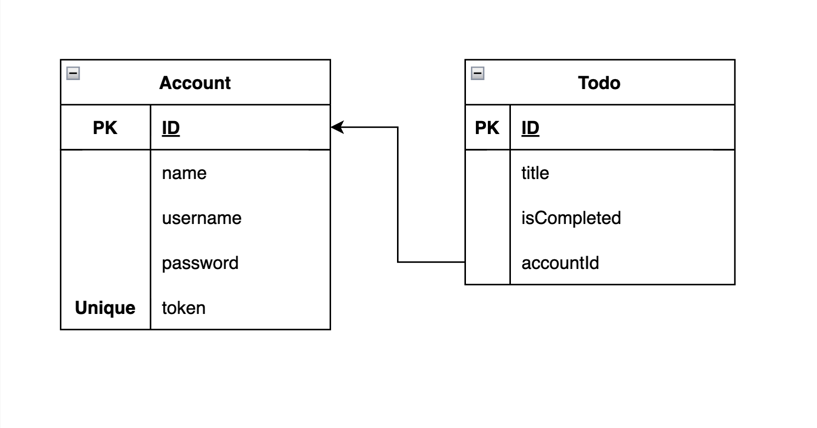

# Simple Todo List API

## Features

- Specific account
- Create, Delete, Update todos

**BaseUrl:** `api/v1`

---
### Accounts

User can create specific account for manage own todo list

**[See docs](./Accounts.md)**

---

### Todos

Manage account todos list

**[See docs](./Todos.md)**

---

Database Structure

